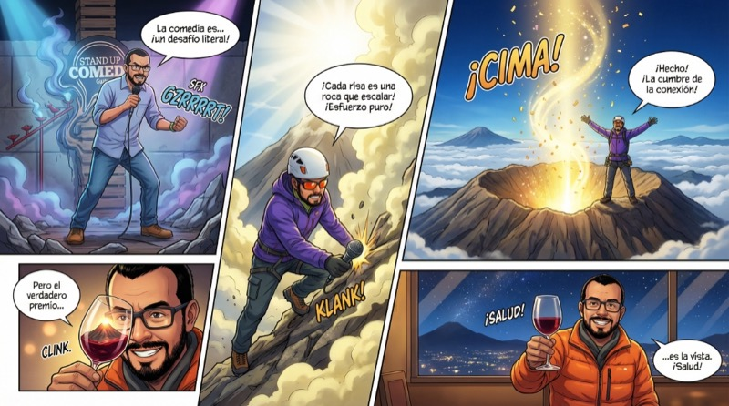
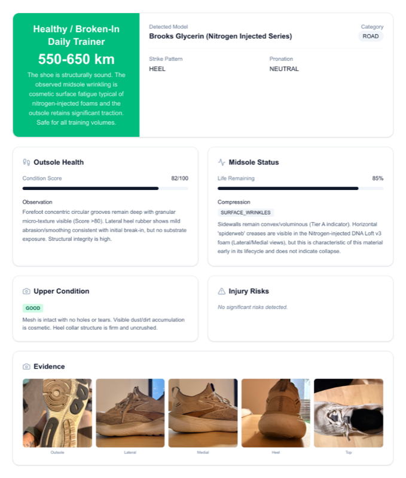
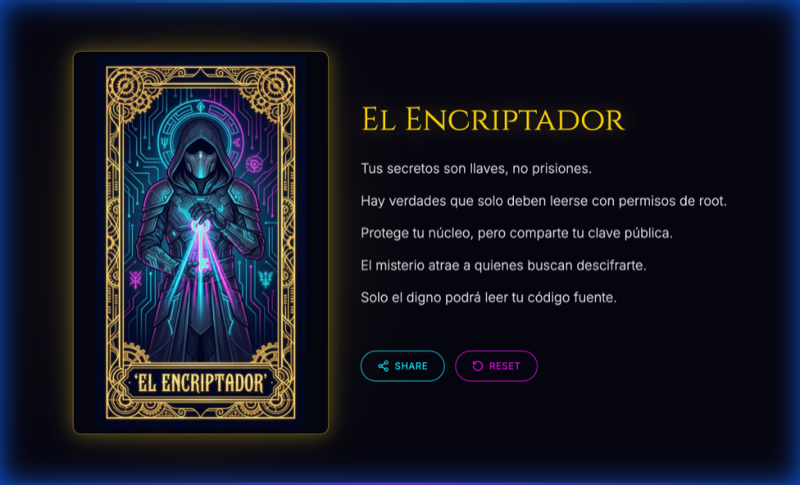
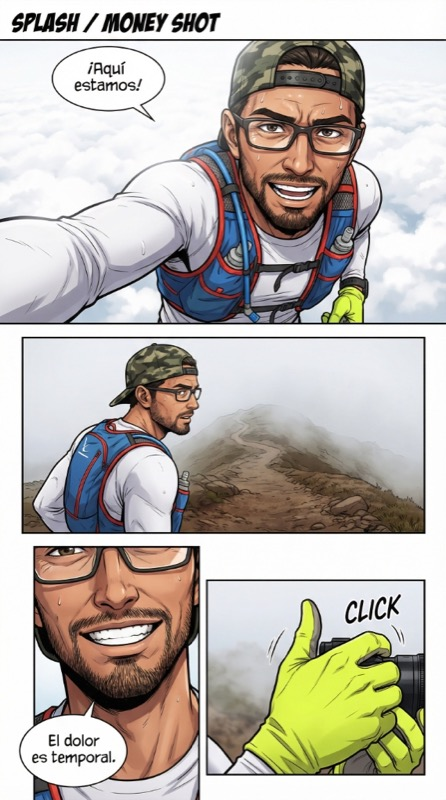

# Gemini 3 Experiments

A collection of experiments using Gemini 3 and Nano Banana Pro. Google Cloud credits are provided for these projects. #AISprint

## Projects

### 1. [Panel One](https://github.com/ykro/panel-one)
A digital storytelling tool that take up to 8 photos, creates a narrative y generates a comic panel.
- **Try it:** [Live Demo](https://panel-one-frontend-txrlrpoirq-uc.a.run.app/)

### 2. [Run-or-Done](https://github.com/ykro/run-or-done)
Analyzes the condition of running shoes to determine if they are safe to run in or need replacing.
- **Try it:** [Live Demo](https://run-or-done-504954692234.us-central1.run.app/)

### 3. [RunSight](https://github.com/ykro/run-sight)
Deep Strategic Athletic Analysis App that takes a FIT file and provides feedback.
- **Try it:** [Live Demo](https://runsight-web-504954692234.us-central1.run.app/)

### 4. [Cosmic Oracle](https://github.com/ykro/cosmic-oracle)
Napkin-to-app, shows the journey from a drawing to a working app using AI to create the mockup, generate assets and generate the app.
- **Try it:** [Source Code](https://github.com/ykro/cosmic-oracle)

### 5. [Motion Manga](https://github.com/ykro/motion-manga)
Transforms short videos into manga-style comic pages using multimodal AI.
- **Try it:** [CLI Tool](https://github.com/ykro/motion-manga)

### 6. Tempo Lottery
*Coming soon*

### 7. Antigravity refactoring
*Coming soon*